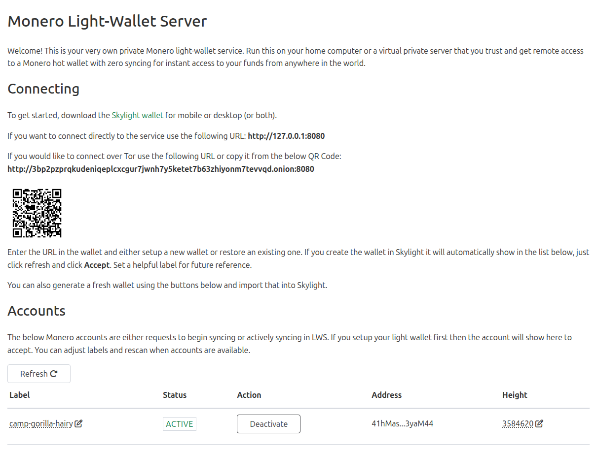

# lwsadmin

A personal Monero light-wallet service, allowing an always-on, immediate use wallet without sync times or waiting. Packages the following services in one easy to use deployment:

* `monero-lws` by [vtnerd](https://github.com/vtnerd/monero-lws) - scans your wallet's view keys in the background
* `lwsadmin` by [lza_menace](https://github.com/lalanza808) - backend CRUD app for managing the LWS backend

The light-wallet compatible options are:

* [Skylight](https://skylight.magicgrants.org/) (what i use)
* [Edge](https://edge.app/monero-wallet/)

## Running

The stack does not include `monerod` which is required. You will need to run that separately; I use [docker-monero-node](https://github.com/lalanza808/docker-monero-node/).

When `monerod` is running, clone the repo and run: `docker compose up -d`

- `lwsadmin` will be available at http://127.0.0.1:5000
- `monero-lws` will be available at http://127.0.0.1:8080 (rpc) and http://127.0.0.1:8081 (admin)

